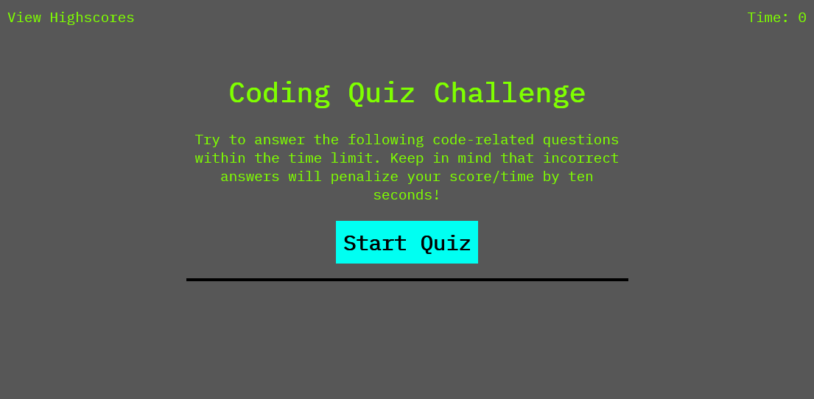
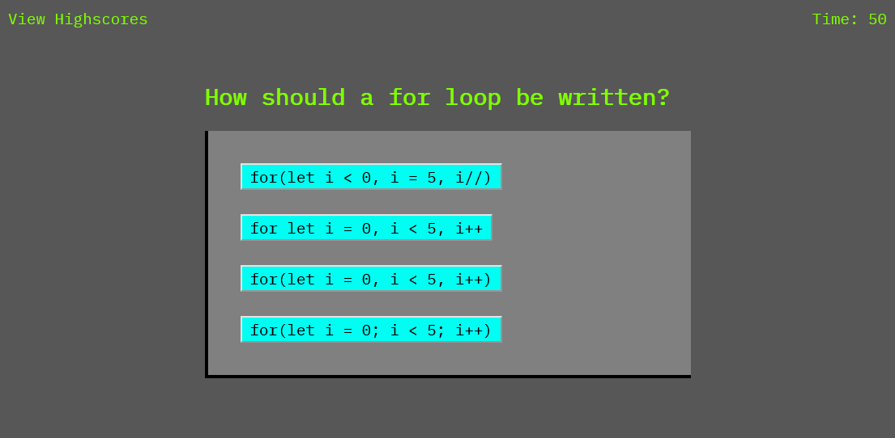

# Code Quiz: JavaScript

## Description

This application is a timed quiz of the basics of JavaScript. 

The user has 60 seconds to answer 5 questions. The questions are multiple-choice. The score is the number of seconds left at the end of the quiz. Giving a wrong answer on the quiz will knock ten seconds off the timer.

At the end of the quiz, the user can enter their initials to save their score to a highscores leaderboard. The user can also click on a button the clear results off the highscores leaderboard.

------

## Installation
The application can be run in-browser by visiting the URL (see below). The user can navigate the quiz by clicking buttons, and can type in their initials to save thier name to the highscores board. 

------

## Development
The application has two HTML pages which are styled in CSS.
The main quiz logic is JavaScript and utilises functions, for-loops and if-else statements. The user's initials and score are saved and then retrieved and displayed using local storage. The questions for the quiz are stored in an array.

------

## My eperience building this app

I found building this quiz to be a real challenge. I struggled a lot, firstly with the logic to make the questions only display the correct number of options at once, and then working out how to disable buttons between selecting answers.

I mostly enjoyed styling the game in CSS. I also found it fun creating elements dynamically and turning them into functional elements. 

From creating this app I think I learned more about using localStorage and gained a better understanding of the importance of setting attributes such as ID. 

Going forward I would like to improve my understanding of how to apply methods such as forEach and the 'this' keyword as I think being able to use these would have streamlined this. 

This app could be improved by having a bigger selection of questions, and then choosing 5 to display at random. 

------

## License
This application has an MIT License.

------
## Links
### URL of GitHub repo:
https://github.com/jh871/Code-Quiz

### URL of deployed application
https://jh871.github.io/Code-Quiz/

--------
## Screenshots of deployed application:
### Screenshot of start page:

### Screenshot of question page featuring timer:
